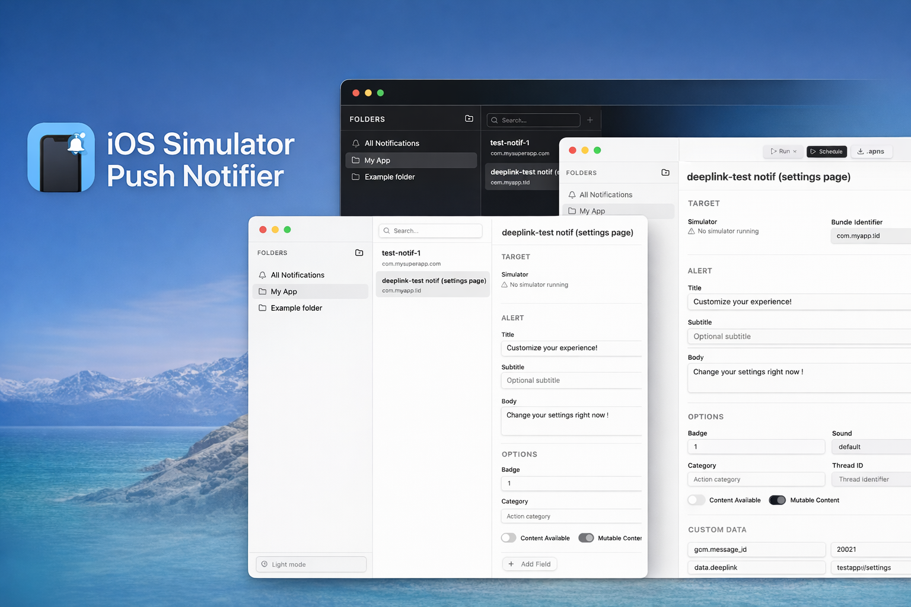

<p align="center">
  
</p>

<h1 align="center">iOS Simulator Push Notifier</h1>

<p align="center">
  <strong>A native macOS app to craft, organize, and send push notifications to the iOS Simulator.</strong>
</p>

<p align="center">
  
  
  
  
</p>

---

## Why?

Testing push notifications on the iOS Simulator normally means hand-editing JSON files and running `xcrun simctl push` from the terminal. **iOS Simulator Push Notifier** gives you a visual editor, folder-based organization, and one-click delivery — so you can focus on building your app instead of wrestling with payloads.

## Features

### 🔔 Full APNS Payload Editor

Build complete Apple Push Notification payloads without touching JSON. Edit the alert title, subtitle, body, badge, sound, category, thread ID, content-available, mutable-content, and arbitrary custom data fields — all from a clean form UI. A live JSON preview keeps you in sync.

### 📁 Folder Organization

Group notifications into folders just like Apple Notes. Create, rename, reorder, and delete folders. Move all notifications from one folder to another in a single action. An **All Notifications** view shows everything at a glance.

### 📱 Simulator Auto-Detection

Booted simulators are detected automatically and refresh every 5 seconds. Installed apps are discovered via `simctl listapps`, so you can pick the target bundle identifier from a dropdown instead of typing it by hand.

### ▶️ One-Click Send

Hit **Run** (or <kbd>⌘↩</kbd>) to push the current notification to the selected simulator instantly.

### 📤 Import & Export `.apns` Files

- **Import** — Open `.apns` / `.json` files via the file picker or **drag-and-drop** them onto a folder.
- **Export** — Download any notification as a portable `.apns` file.

### ⏱️ Scheduling

Send a notification once after a delay, or set up a recurring cron schedule. Active schedules survive app restarts and show a status banner in the editor.

### ⌨️ Keyboard Shortcuts

| Action               | Shortcut          |
| -------------------- | ----------------- |
| New Notification     | <kbd>⌘N</kbd>    |
| New Folder           | <kbd>⌘⇧N</kbd>   |
| Delete               | <kbd>⌘⌫</kbd>    |
| Run Notification     | <kbd>⌘↩</kbd>    |
| Schedule             | <kbd>⌘⇧S</kbd>   |

### 🌙 Dark Mode

Ships with a dark theme that respects the native macOS look and feel.

---

## Getting Started

### Prerequisites

- **macOS** with [Xcode](https://developer.apple.com/xcode/) installed (for `xcrun simctl`)
- At least one booted iOS Simulator

### Install

Download the latest release from the [Releases page](https://github.com/gogson/ios-simulator-push-notifier/releases).

### Unsigned App Notice

This app is **not code-signed or notarized** by Apple. macOS will block it from opening by default. To allow it:

1. Try to open the app — macOS will show a warning and refuse.
2. Go to **System Settings → Privacy & Security**.
3. Scroll down to the **Security** section — you'll see a message about the blocked app.
4. Click **Open Anyway** and confirm.

You only need to do this once.

---

## Tech Stack

| Layer       | Technology                                       |
| ----------- | ------------------------------------------------ |
| Shell       | [Electron](https://www.electronjs.org/) 39       |
| Build       | [electron-vite](https://electron-vite.org/)      |
| Renderer    | [React](https://react.dev/) 19 + TypeScript 5.9  |
| Styling     | [Tailwind CSS](https://tailwindcss.com/) 4 + [shadcn/ui](https://ui.shadcn.com/) |
| Database    | [SQLite](https://www.sqlite.org/) via better-sqlite3 |
| Scheduling  | [node-cron](https://github.com/node-cron/node-cron) |
| Simulator   | `xcrun simctl push` (Xcode CLI)                  |

---

## Development

### Prerequisites

- **Node.js** 20+

### Install & Run

```bash
# Clone the repo
git clone https://github.com/gogson/ios-simulator-push-notifier.git
cd ios-simulator-push-notifier

# Install dependencies
npm install

# Launch in development mode
npm run dev
```

### Build for Production

```bash
# Build a macOS .zip (universal: x64 + arm64)
npm run build:mac
```

The output will be in the `dist/` directory.

---

## Releases

Releases are automated via GitHub Actions. Push a version tag to trigger a build:

```bash
git tag v1.0.0
git push origin v1.0.0
```

A macOS `.zip` artifact will be uploaded to the [GitHub Release](https://github.com/gogson/ios-simulator-push-notifier/releases) automatically.

---

## Project Structure

```
src/
├── main/                  # Electron main process
│   ├── index.ts           # App lifecycle, window, menu
│   ├── db.ts              # SQLite schema & CRUD
│   ├── simulator.ts       # xcrun simctl wrapper
│   ├── scheduler.ts       # Cron job management
│   └── ipc-handlers.ts    # IPC bridge registration
├── preload/               # Context bridge
│   ├── index.ts           # API exposed to renderer
│   └── index.d.ts         # TypeScript declarations
└── renderer/              # React frontend
    └── src/
        ├── App.tsx         # 3-panel layout + drag & drop
        ├── components/     # FolderList, NotificationList, NotificationForm, ScheduleDialog
        ├── hooks/          # useData (folders, notifications, simulators, schedules)
        └── lib/            # APNS payload builder, utils
```

---

## License

MIT
